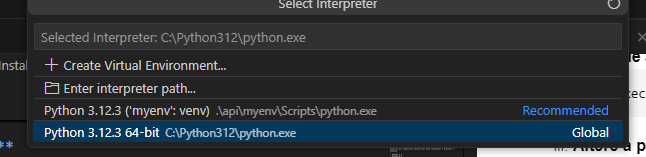

# desafio-dev-backend

## Sumário

- [desafio-dev-backend](#desafio-dev-backend)
  - [Sumário](#sumário)
  - [Descrição](#descrição)
  - [Resultados Esperados](#resultados-esperados)
  - [Funcionalidades](#funcionalidades)
  - [Tecnologias Utilizadas](#tecnologias-utilizadas)
  - [Instalação](#instalação)
  - [Uso](#uso)
  - [Documentação](#documentação)
  - [Licença](#licença)

## Descrição

Estou criando esse repositório para um teste técnico para uma vaga de Beck-end, tendo como objetivo: 
"Criar uma aplicação CRUD básica com banco de dados e API em Python..." 

## Resultados Esperados


"Ao final deste desafio, deve existir uma aplicação backend capaz de criar , atualizar , remover e selecionar dados de um banco de dados."


## Funcionalidades

- Criar dados em um banco de dados;
- Atualizar dados em um banco de dados;
- Remover dados em um banco de dados;
- Selecionar dados em um banco de dados.

## Tecnologias Utilizadas

- Python (Framework Django)
- MYSQL


## Instalação

Passo a passo de como configurar o ambiente de desenvolvimento e instalar as dependências.

1. Clone o repositório:
   ```bash
   git clone https://github.com/allysonlipe/desafio-DEV-BackEnd.git
   ```

2. Navegue até o diretório do projeto:
   ```bash
   cd api
   ```

3. Crie e ative um ambiente virtual:
   ```bash
   python -m venv myenv
   source myenv/bin/activate  # No Windows: myenv\Scripts\activate
   ```
   Caso encontre o seguinte erro:
   ```
   não pode ser carregado porque a execução de scripts foi desabilitada neste sistema.     
   Para obter mais informações, consulte about_Execution_Policies em 
   https://go.microsoft.com/fwlink/?LinkID=135170.
   No linha:1 caractere:3
   ```
   1. **Abra o PowerShell como Administrador;**
   &nbsp;
   2. **Verifique a política atual (opcional):**
      ```
      Get-ExecutionPolicy
      ```
   3. **Altere a política de execução para permitir scripts:**
      ```
      Set-ExecutionPolicy RemoteSigned
      ```
   4. **Confirme a alteração:**
         Quando solicitado, pressione Y e depois Enter para confirmar a alteração.
   5. **Tente ativar o ambiente virtual novamente:**
         ```
         source myenv/bin/activate  # No Windows: myenv\Scripts\activate
         ```


4. Pressione `Ctrl` + `Shift` + `P`, e ao abrir a janela abaixo, digite `Python: Select Interpreter` e selecione a opção marcada como na imagem abaixo: 
   

5. Agora, selecione a segunda opção da imagem, `Enter interpreter path`:
   
6. Agora, clique em `Find...`
   
7. O passo anterior irá abrir uma janela de gerenciador de arquivos, nessa janela, você vai selecionar o caminho da sua `env\scripts`:
   

8. E selecionar o arquivo `python`:
   
9. Para instalar todas as dependências, execute:
   ```bash
   pip install -r requirements.txt
   ```
10. Após isso, você tem duas opções: rodar os comandos sql da pasta banco de dados, ou executar as migrations da api. Esse tutorial vai ser feito pela migrations, mas fique livre para executar os códigos sqls pelo SGBD ou terminal de sua preferência.

11. Dentro do seu projeto, há um arquivo chamado settings.py, procure por **DATABASES** e preencha de acordo com a configuração do seu banco de dados.
   
   ```env
    'default': {
        'ENGINE': 'django.db.backends.mysql',
        'NAME': 'desafio',
        'USER':'root',
        'PASSWORD':'admin',
        'HOST': 'localhost',
        'PORT':'3306',
    }
   ``` 

12. Crie um banco chamado desafio, Precisamos que o banco já esteja criado para executarmos as migrations. Ele pode ser criado com o comando SQL: 
    ```sql 
      mysql> CREATE DATABASE IF NOT EXISTS desafio;
    ```
13. Crie um banco chamado desafio, Precisamos que o banco já esteja criado para executarmos as migrations. Ele pode ser criado com o comando SQL: 
   ```bash
   python manage.py migrate
   ```
14. Agora, o projeto esta pronto para uso, se você desejar utilizar o postman, temos o arquivo de backup na raiz do nosso projeto, chamado: **desafio-backend.postman_collection.json**
   
## Uso

Instruções sobre como executar o projeto.

1. Inicie o servidor:
   ```bash
   python manage.py runserver
   ```
2. Você pode acessar a aplicação em `http://localhost:8000`.

## Documentação

A documentação da API está disponível no Swagger. Você pode visualizar e testar as rotas da API através do seguinte link:

- [Documentação da API](https://app.swaggerhub.com/apis-docs/AllysonPhilipe/desafio-backend_api/1.0.0)

Se preferir, você também pode usar o arquivo de coleção do Postman disponível na raiz do projeto para importar as rotas e testar a API localmente.


## Licença

This project is under MIT license. See the [LICENSE](LICENSE.md) for more details.